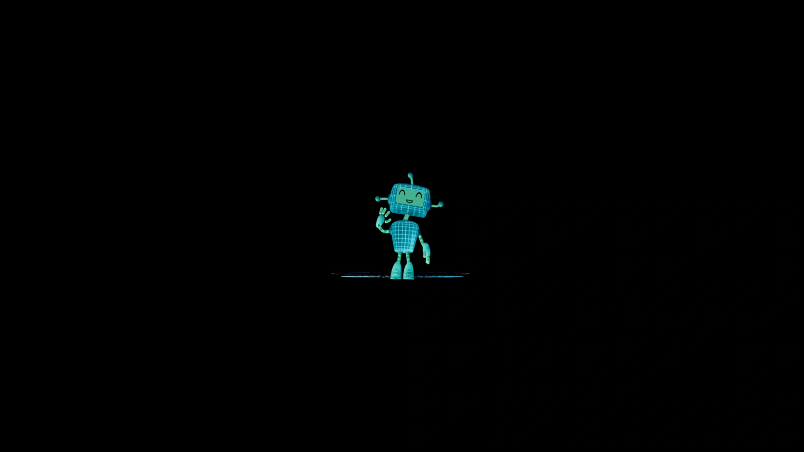

<div align="center">
      
  <h3 align="center">3D Animations - Three Fiber</h3>
</div>

##  <br /> 📋 <a name="table">Table of Contents</a>

- ✨ [Introduction](#introduction)
- ⚙️ [Tech Stack](#tech-stack)
- 📝 [Features](#features)
- 🚀 [Quick Start](#quick-start)

##  <br /> <a name="introduction">✨ Introduction</a>

**[EN]** A collection of practice 3D animations created using Three.js, React Three Fiber, and Drei. This repository showcases various animation techniques and effects, demonstrating the capabilities of these libraries for building interactive 3D visuals.

**[FR]** Une compilation d'animations 3D réalisées avec Three.js, React Three Fiber et Drei. Ce dépôt présente diverses techniques et effets d'animation, démontrant les capacités de ces bibliothèques pour créer des visuels 3D interactifs.

##  <br /> <a name="tech-stack">⚙️ Tech Stack</a>

- **React** is a popular JavaScript library for building user interfaces, particularly single-page applications where data changes over time. React's component-based architecture allows developers to create reusable UI components, making development more efficient and the codebase easier to maintain. 

- **Next.js** is a React framework known for its server-side rendering (SSR) and static site generation (SSG) capabilities, enhancing performance and SEO for web applications. It offers features like automatic code splitting, API routes for server-side logic, and a plugin system for extensibility.

- **TypeScript** is a statically typed superset of JavaScript that allows for early detection of errors and more robust, maintainable code. TypeScript's type system helps developers catch mistakes early during the development process, ensuring a more stable and reliable application.

- **Tailwind** is a utility-first CSS framework that speeds up UI development by providing a set of pre-built utility classes. It allows developers to quickly build custom designs without writing traditional CSS, promoting rapid prototyping and design consistency.

- **Three.js** is a JavaScript library that enables the creation and display of 3D computer graphics in web browsers using WebGL. It provides extensive capabilities for rendering 3D scenes, including support for geometries, materials, lighting, and animations.

- **Three Fiber** is a React renderer for Three.js, enabling the use of Three.js within React applications. It provides a declarative API that allows developers to create and manage 3D scenes using React components, making it easier to integrate 3D graphics into React applications. React Three Fiber simplifies the process of handling Three.js objects, lights, and animations, while leveraging React’s component-based architecture for more manageable and reusable 3D code.

- **Three Drei** is a collection of useful helpers and abstractions for React Three Fiber. It offers a set of ready-to-use components and hooks for common Three.js tasks, such as managing lights, controls, and geometries. By providing higher-level abstractions, React Three Drei streamlines the process of creating complex 3D scenes and interactions, enhancing productivity and reducing boilerplate code in React Three Fiber projects.


## <br /> <a name="quick-start">🚀 Quick Start</a>

Follow these steps to set up the project locally on your machine.

<br/>**Prerequisites**

Make sure you have the following installed on your machine:

- [Git](https://git-scm.com/)
- [Node.js](https://nodejs.org/en)
- [npm](https://www.npmjs.com/) (Node Package Manager)

<br/>**Cloning the Repository**

```bash
git clone {git remote URL}
```

<br/>**Installation**

Let's install the project dependencies, from your terminal, run:

```bash
npm install
# or
yarn install
```

<br/>**Running the Project**

Installation will take a minute or two, but once that's done, you should be able to run the following command:

```bash
npm run dev
# or
yarn dev
```

Open [`http://localhost:3000`](http://localhost:3000) in your browser to view the project.